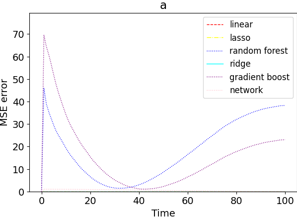

# Experiments of Aggregate Computing combined with AI 

## Hop-count with multiple Input.

### Description:

This experiment is an extesion of [Hop count regression](https://github.com/cric96/experiments-ac-with-learning/tree/hop-count-regression). Please refear to its [README](https://github.com/cric96/experiments-ac-with-learning/tree/hop-count-regression#readme) before read this document.

---

This experiment is set up as **Hop count regression** but, in this case, instead of taking only the minimum value within the neighboorhood, we extract three values (min, max, average). So [ExtractCsv](src/main/scala/it/unibo/alchemist/model/implementations/actions/ExtractCsv.scala) exports:
1. min neighhbour value
2. max neighbour value
3. average neighbour value
4. isTarget
5. isNotTarget

`isTarget` and `isNotTarget` are one the opposite of the other. I try to encode this boolean value in two values to avoid some numerical correlation. But, this modification doesn't change the performace.

The simulation set up is the same of **Hop count regression**.
The training function has the shape of:
```  
(min, max, avg, isTarget, isNotTarget) => hop count
```
In total, I have gathered 900 samples.
#### Training configuration
The configuration is the same of **Hop count regression**
#### Validation configuration
Same as **Hop count regression**.
#### What happens
The liner model and neural network learns the function (min + 1). In this case, I don't try to learn the function: `isTarget == 1 ==> 0.0`.
Other regressors can't learn the right function (again, they cannot generalize).


*network* is the performance of a fully connected *neural network* composed of four hidden layers:
- input : 5 neurons
- hidden : 128 => 64 => 32 neurons
- output : 1 neuron

Each line shows the MSE according to the standard implementation. *network* and linear models have a near 0 error. 
Instead, random forest and gradient boost have a substantial error. Looking the output, seems that these model can't generalize and
tend to overfit the training set.
#### Final remarks
The result is what I have expected. Indeed, if in the previous experiment the models can learn `min + 1`, even in this case they can learn the same function. What is very challenging is to extract these value using another regressor. 
