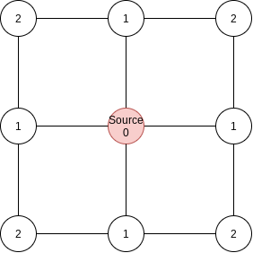
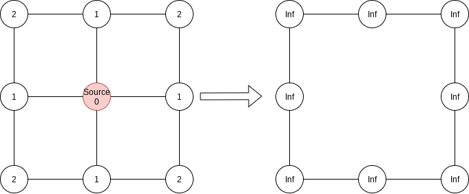

# Experiments of Aggregate Computing combined with AI 

## Hop-count with regression

### Description:

In this experiment, I have tried to implement the hop count algorithm using a standard ML regression technique.
To generate the data set, I have run multiple Alchemist simulations in which each node has a global system vision. 
Hence, using a breadth graph search, each node knows the correct hop count value.
After a predefined period, for each node, [ExtractCsv](src/main/scala/it/unibo/alchemist/model/implementations/actions/ExtractCsv.scala) exports:
1. min neighbor value;
2. output value (target);
3. a boolean value that tells if a node is a source or not.

In each simulation (program [HopCountOracle](src/main/scala/it/unibo/simulations/HopCountOracle.scala) configuration [simulation.yml](src/main/yaml/simulation.yml)), 
there are 150 nodes displaced randomly in a square large 500x500. 

The training function has the shape of:

*(min neighbour, source) => output*

In total, I have gathered 900 samples.
#### Traning configuration
I have tried to train:
- linear regressor;
- gradient regressor;
- random forest regressor.

Considering the learning algorithm's simplicity, I choose the smile framework to validate the result.
#### Validation configuration
To validate the result (program [PerformanceComparator](src/main/scala/it/unibo/casestudy/PerformanceComparator.scala) configuration [multi_validation.yml](src/main/yaml/multi_validation.yml) I run standard hop count implementation and another regression model. Here, I have decided to increment the node count to see if the model succeeded in the generalization task. The error is computed as a squared error for each time sample.
#### What happens
The liner model learns the function (m + 1) but obviously can't learn **when a source is true the output is always 0**. Gradient and random forest models don't generalize, so with higher node count don't increment the value by one.
So, to validate the result, I introduce a "bias" in the execution, namely:
```
mux (source) { 0 } { regression.predict(input) }.
```
By doing so, the error is the following:


#### Final remarks

This example is surely too simple, but it helps me to make some considerations.

*Is it correct to guide the model in real case scenario?*

Introducing bias in learning tasks could speed up the convergence of machine learning algorithms.
But, on the other hand, this constrains the learning process. If we put some wrong constraint, the algorithm could learn something wrong. So careful attention has to be used when we add restrictions.

*How to gather data?*

This is a tricky part of our learning process. In this case, I took only the last "snapshot" of *computational field* and then I extracted the data. For example, having a grid world like this:


I evaluated the world after the simulation run with a global view, so when the field is like this:



And in general, it is a good choice because in the transitory things could go bad in an uncontrolled way.
Unfortunately, sometimes I need temporal information about what is happening. Suppose that source disappears, the resultant computational field is composed of infinity in each point. 
In this case, using a global viewpoint, I see first a correct field of hop count and then a field filled by infinity:



What is difficult for us is to understand the transient. We know how to evaluate in the end whether a field is right or not, but during its execution, it is difficult for us to understand what a node is supposed to produce at a defined time. I think it's related to the usual problem of local and global mapping.

*What model could be more appropriate for learning AC function?*

In general, we cannot presume that we always can extract a singualar (or fixed) data from the neighbour.
All traditional ML techinques suppose that the input is fixed. 
So, I immagine that we need to use novel techinque like RNN.

*What is intrique*
If we can find a way to learn from example, we can execute simulation in little network, and teorically scale up to large-scale system, that is a very interisting perspective to our research.


