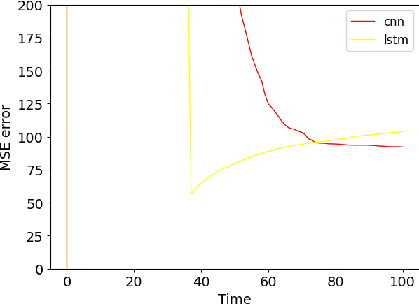

# Experiments of Aggregate Computing combined with AI 

## Hop-count with variable input

### Description:

In this branch, I try to use AI models to learn at extracting the correct value within a node neighbourhood. Even in this case, I try to learn [Hop Count Function](https://github.com/cric96/experiments-ac-with-learning/tree/hop-count-regression), so I recommend you to read that part first.

In the following, there is a brief description of regression models that can handle variable input size.
#### Background

In general, regression models (and also classification models) presume that the input size is fixed. It is a problem in our domain: we don't have any guarantee in the input size (i.e. the neighbour values that the node gather) since the network is not *fixed* and can change over time.
So, as the first experiments, I try to use two regression models that are independent of the input size: [(Fully) Convolutional Neural Network](https://stanford.edu/~shervine/teaching/cs-230/cheatsheet-convolutional-neural-networks), and [Recurrent Neural Network](https://stanford.edu/~shervine/teaching/cs-230/cheatsheet-recurrent-neural-networks). I want to point out that in general is a good practice to pre-process input, so even the previous approaches could be valuable (e.g. extracting only the min or a set of relevant values, in ML is usually to select a group of relevant feature).

#### Convolutional Neural Network

#### Recurrent Neural Network

### Validation configuration

### What happens

### Final remarks
